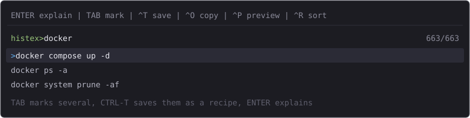

# histex

An interactive picker for your shell command history: fuzzy-search the commands
you already ran, get them explained, and turn the useful ones into saved recipes
or ready-to-run scripts.

Built for **Windows + PowerShell**. It also *parses* bash, zsh and fish history
files (`.bash_history`, `.zsh_history` incl. `#epoch` markers and zsh
`: time:0;cmd` lines, fish's YAML `- cmd:` records) and brings a bash/zsh prompt
snippet of its own, but only the Windows path is proven on a real machine so far.
A single Go binary, standard library only. fzf draws the picker and the Windows
release ships a matching build of it, so nothing has to be installed.



<details>
<summary>Text-only version of the same screen</summary>

```
┌─────────────────────────────────────────────────────────────────────┐
│ ENTER explain | TAB mark | ^T save | ^O copy | ^P preview  663/663│
│ histex> docker                                                      │
│ > docker compose up -d                                              │
│   docker ps -a                                                      │
│   docker system prune -af                                           │
└─────────────────────────────────────────────────────────────────────┘
```

</details>

## Why

Your history is full of solutions you already found. histex turns it into a
browsable, explainable knowledge base:

- **find** - fzf over your deduplicated history (newest first, or most used first)
- **understand** - explanations from local `tldr` pages, PowerShell `Get-Help`,
  the tool's own `--help` and cheat.sh, tried in order, cached, and mostly
  available offline
- **keep** - save the commands that worked as a Markdown recipe, and optionally
  generate a runnable `.ps1`, `.bat` or `.sh` script
- **reuse** - copy anything to the clipboard without leaving the picker

## Requirements

| | |
|---|---|
| Windows | **just the binary** - `histex.exe` is one self-contained file, no runtime needed |
| Linux / macOS | same binary, one file per platform; fzf has to be installed separately there |
| fzf | **required** - ships in the Windows release, or `winget install junegunn.fzf` |
| tldr | optional, recommended - `winget install dbrgn.tealdeer`, then `tldr --update` |
| Go | 1.27+ - only to build from source; not needed to run the binary |

## Install

### Windows

`histex.exe` is a **self-contained file** - download it, put fzf next to it,
run it. Nothing gets installed, and nothing is written next to them (your
recipes, scripts and cache live in `%APPDATA%\histex`).

**1. Download histex.exe**

```powershell
curl.exe -L -o histex.exe https://github.com/GOGA08/histex/releases/latest/download/histex.exe
```

or open the [releases page](https://github.com/GOGA08/histex/releases) and
download the `histex.exe` asset.

**2. Download fzf next to it** - histex has no picker of its own, fzf draws the
list, and the same release ships a matching build (fzf 0.74.4, MIT - the
license text is attached as `fzf-LICENSE.txt`):

```powershell
curl.exe -L -o fzf.exe https://github.com/GOGA08/histex/releases/latest/download/fzf.exe
```

histex prefers an `fzf.exe` sitting next to it, so this works even when fzf is
not on your `PATH`. If you already have fzf, or prefer a managed install, skip
this step: `winget install junegunn.fzf` (or `scoop install fzf`).

**3. Optional but recommended** - local tldr pages, so explanations work offline:

```powershell
winget install dbrgn.tealdeer
tldr --update
```

**4. Check the setup, then start it:**

```powershell
.\histex.exe --doctor      # tools, history, clipboard, recipes
.\histex.exe               # the picker: ENTER explains, CTRL-T saves
```

**If Windows shows "Windows protected your PC",** that is SmartScreen reacting
to the Mark-of-the-Web that *browsers* attach to downloads - not to histex
itself. The `curl.exe` commands above never add that mark, so it normally does
not happen; if you downloaded through a browser instead, clear it with:

```powershell
Unblock-File .\histex.exe
Unblock-File .\fzf.exe
```

(or allow it once: **More info -> Run anyway**).

To run it simply as `histex` from anywhere, put `histex.exe` and `fzf.exe` in
a folder that is on your `PATH` (for example `%USERPROFILE%\bin`). Open a
**new** terminal after a `winget install` - that is what refreshes `PATH`.

**Or install it with scoop** instead of downloading (scoop pulls fzf as a
dependency, and a package manager never adds the Mark-of-the-Web):

```powershell
scoop install https://raw.githubusercontent.com/GOGA08/histex/main/packaging/scoop/histex.json
histex --doctor
```

### Linux / macOS

The same code runs here - CI builds and self-tests it on Ubuntu for every
commit - but the bundled download is Windows-only, so fzf must be installed
separately.

```bash
# Linux, x86_64 (or histex-linux-arm64)
curl -LO https://github.com/GOGA08/histex/releases/latest/download/histex-linux-amd64
chmod +x histex-linux-amd64

# macOS, Apple silicon (Intel: histex-darwin-amd64)
curl -LO https://github.com/GOGA08/histex/releases/latest/download/histex-darwin-arm64
chmod +x histex-darwin-arm64

# fzf is required: apt install fzf | brew install fzf | pacman -S fzf | ...
# optional, for offline explanations: tealdeer (the tldr client)

./histex-linux-amd64 --doctor    # tools, history, clipboard, recipes
./histex-linux-amd64             # the picker
```

Move the file somewhere on your `PATH` (for example `~/.local/bin/histex`).

`--install-snippets` writes `histex_profile.sh` on Linux/macOS - the picker
function plus a `PROMPT_COMMAND` / `precmd` hook - and a PowerShell snippet on
Windows. Both feed the same `history_log.tsv` that `--today` and `--here` read.

### Verify the download (optional)

Every release carries a `SHA256SUMS` file with the hash of each asset. Compare
the line for the file you downloaded:

```bash
sha256sum histex-linux-amd64         # Linux (or: sha256sum -c SHA256SUMS --ignore-missing)
shasum -a 256 histex-darwin-arm64    # macOS
```

```powershell
Get-FileHash .\histex.exe -Algorithm SHA256     # Windows
```

### Build from source (developers)

Go 1.27+ is needed **only** for building - the result is the same
self-contained binary.

```powershell
git clone https://github.com/GOGA08/histex.git
cd histex
go build -o histex.exe .
powershell -ExecutionPolicy Bypass -File .\install.ps1
.\histex.exe
```

`install.ps1` checks fzf and tldr, builds `histex.exe` when it is missing,
writes the config file and runs `--doctor` plus `--self-test`. It never edits
`$PROFILE` - that stays your decision. The manual steps it performs are:

```powershell
winget install junegunn.fzf
winget install dbrgn.tealdeer     # optional but recommended
tldr --update
go build -o histex.exe .
.\histex.exe --init-config
.\histex.exe --doctor
```

While working on the code:

```powershell
gofmt -l .        # must print nothing (CI enforces it)
go vet ./...
go run honnef.co/go/tools/cmd/staticcheck@v0.8.1 ./...
go test ./...     # the same offline checks as --self-test
```

## Keys

| key | action |
|---|---|
| `ENTER` | explain the current / marked command(s) |
| `TAB` / `SHIFT-TAB` | mark / unmark a command (to save several at once) |
| `CTRL-T` | save as a recipe (+ optional runnable script) |
| `CTRL-O` | copy the marked / current command(s) to the clipboard |
| `CTRL-P` (`CTRL-/` too) | toggle the preview pane (hidden by default) |
| `CTRL-R` | reload the list and toggle sorting (recent <-> most used) |
| `ESC` | cancel |

The preview pane is hidden by default so the list uses the full width - press
`CTRL-P` (or `CTRL-/`) to show the highlighted command in full, together with
the cached explanation when there is one. Start with it visible via
`--show-preview`, disable it entirely with `--no-preview`, or resize it with
the `preview_window` setting.

## Modes

```powershell
.\histex.exe                         # interactive picker (histex> prompt)
.\histex.exe --doctor                # health check: tools, history, clipboard
.\histex.exe --stats                 # most used commands and tools
.\histex.exe --stats --since 7d      # only 90m/24h/7d/4w, or 2026-10-01
.\histex.exe --browse                # search your saved recipes (recipes> prompt)
.\histex.exe --clean                 # delete entries from the history (auto backup)
.\histex.exe --restore               # put that backup back
.\histex.exe --shell fish            # read fish / bash / zsh instead of PowerShell
.\histex.exe --explain "tar -xzf a.tgz"
.\histex.exe --pick                  # print only the selection (shell integration)
.\histex.exe --json                  # machine readable output
.\histex.exe --sort freq             # most used first
.\histex.exe --offline               # never touch the network
.\histex.exe --update-tldr           # refresh the local tldr page cache
.\histex.exe --install-snippets      # prompt integration + time/dir log
.\histex.exe --init-config           # write a config file
.\histex.exe --self-test             # offline self checks
```

## Explanations

Sources are tried in order (configurable, first hit wins):

```
local cache -> PowerShell Get-Help -> local tldr pages -> tool help (--help) -> cheat.sh
```

`toolhelp` is the tool's own documentation: for a command like `tar -xzf a.tgz`
it runs `tar --help` and shows the first lines. It needs no install and no
network, and it only ever sees the tool *name* - never your arguments. Turn it
off with `"toolhelp": false`, or drop it from `explain_order`. A `config.json`
you wrote earlier keeps its own order - add `toolhelp` there (before `cheat`) to
switch the new source on.

`Get-Help`, `tldr` and `toolhelp` work offline, answers are cached in
`%APPDATA%\histex\cache`, and `--offline` guarantees nothing leaves your
machine. Commands that look like they contain a secret (`password`, `token`,
...) are never sent to the network.

`tldr` is the one source you may want to install: its pages are hand-written
and much friendlier than a raw `--help` dump for non-PowerShell commands
(`tar`, `git`, `docker`). Without it histex still explains everything -
PowerShell cmdlets from `Get-Help`, other tools from their own `--help`, the
rest from cheat.sh (network). That is why `--doctor` only warns about a missing
`tldr` instead of failing, and why it is listed as "optional, recommended".

## Saving recipes

`CTRL-T` asks for a title (with a suggestion), optional tags, and a format:

```
1 markdown      -> saved_recipes.md
2 +PowerShell   -> scripts/<slug>.ps1
3 +batch        -> scripts/<slug>.bat
4 +bash         -> scripts/<slug>.sh
```

Every recipe is also appended to `recipes.jsonl` for scripting.

`--browse` opens the recipes as their own library: a `recipes> ` prompt (never
the history picker) with a live preview of each recipe's stored commands.

## Configuration

`--init-config` writes `%APPDATA%\histex\config.json`:

| key | meaning |
|---|---|
| `explain_order` | order of the sources: `cache`, `local`, `tldr`, `toolhelp`, `cheat` |
| `sort` | `recent` or `freq` |
| `detail` | `short` or `full` |
| `network`, `cache`, `tldr`, `toolhelp`, `preview` | toggles |
| `exclude` | regexes removed from the picker (noise) |
| `secrets` | regexes that must never go online |
| `danger` | regexes that trigger a warning |
| `max_items`, `cache_ttl_hours` | limits |

## Notes

- The PowerShell history file records neither timestamps nor directories.
  `--install-snippets` writes a small profile snippet (PowerShell, or
  `histex_profile.sh` for bash/zsh) that adds a sidecar log, which enables
  `--today` and `--here`. It never edits `$PROFILE` or `~/.bashrc` for you.
- histex never runs anything from your history. Explanations run fixed helpers
  only: `Get-Help`, `tldr`, cheat.sh and - last and locally - `<tool> --help`
  for the tool name alone, with a 5 second timeout, no pager and no stdin.
- `saved_recipes.md`, `scripts/`, `recipes.jsonl` and `history_log.tsv` are
  git-ignored because they contain your own commands. See
  `saved_recipes.example.md` for the format.

## License

MIT - see [LICENSE](LICENSE).
